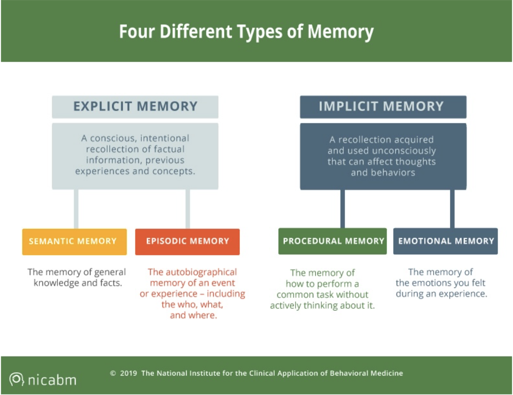
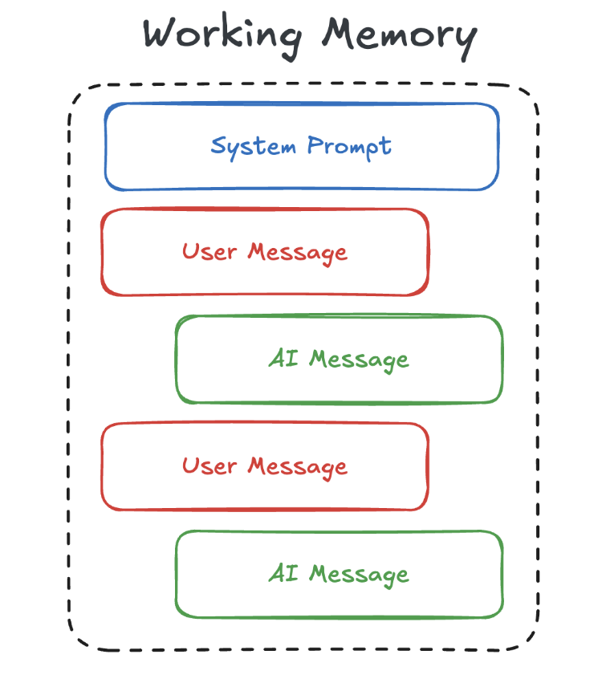
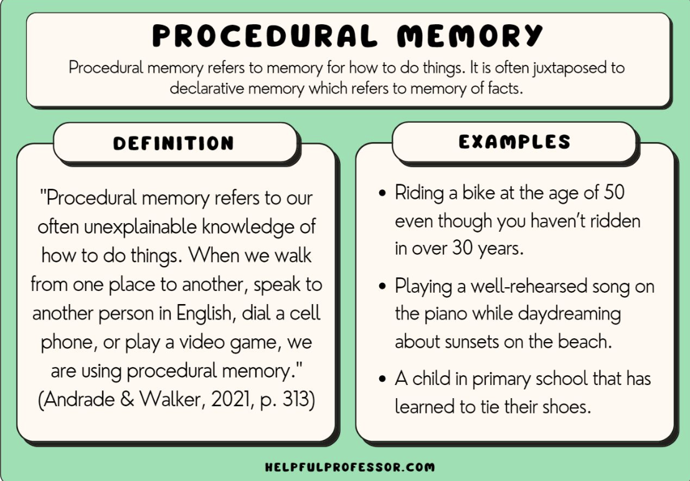
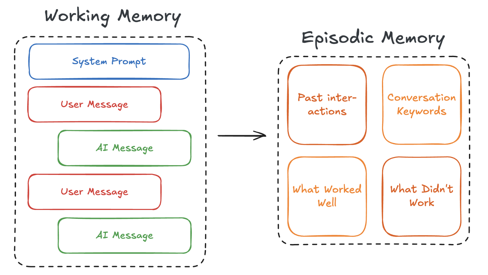
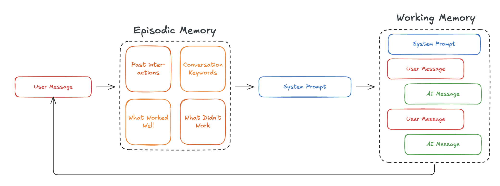
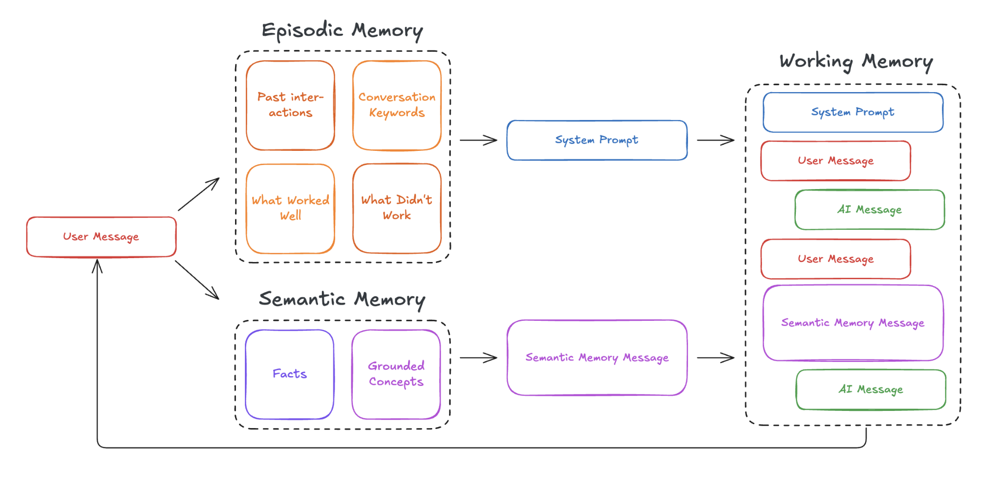
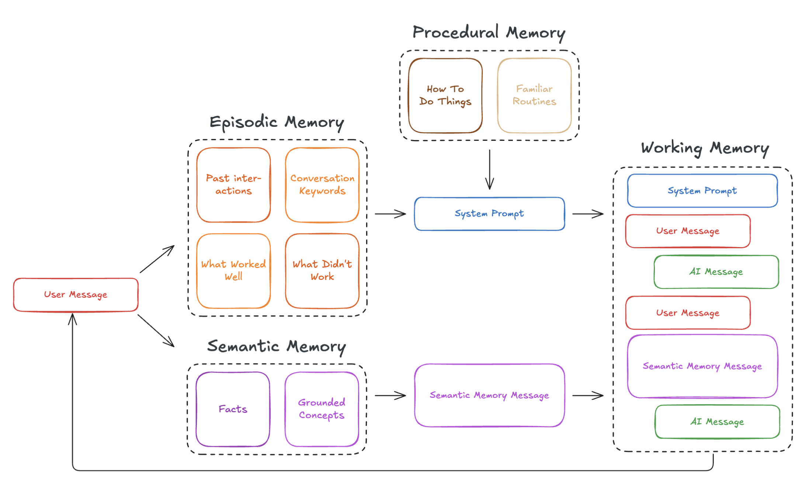
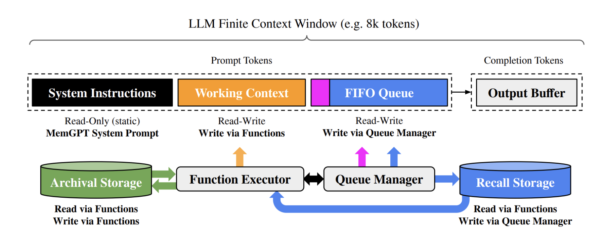

# agentic-memory
Cognitive Architectures for Language Agents
- Stacks: Langchain, Ollama, Weaviate, Docker, ChromaDB
- Reference Document: 
  - [Cognitive Architectures for Language Agents](https://arxiv.org/pdf/2309.02427)
  - [MemGPT: Towards LLMs as Operating Systems](https://arxiv.org/pdf/2310.08560)

## Rag agent with 4 kinds of memory
- Working Memory - Current conversation and immediate context
- Episodic Memory - Historical experiences and their takeaways
- Semantic Memory - Knowledge context and factual grounding
- Procedural Memory - The "rules" and "skills" for interaction

## Database 
### As a memory store, both for "remembering" and for "recalling"

## Working memory

## Procedural memory

## Working memory to Episodic memory

## Semantic Memory with Episodic and Working Memory 

## Full Working Memory

## MemGPT
