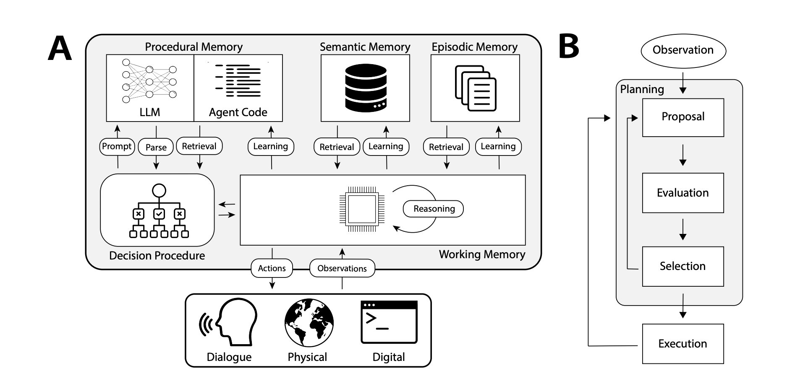

# agentic-memory
Cognitive Architectures for Language Agents

Reference Document: [Cognitive Architectures for Language Agents](https://arxiv.org/pdf/2309.02427)

## Rag agent with 4 kinds of memory
- Working Memory - Current conversation and immediate context
- Episodic Memory - Historical experiences and their takeaways
- Semantic Memory - Knowledge context and factual grounding
- Procedural Memory - The "rules" and "skills" for interaction